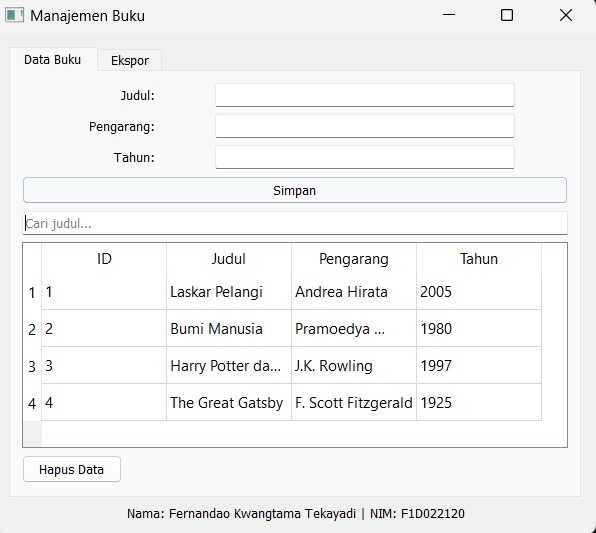
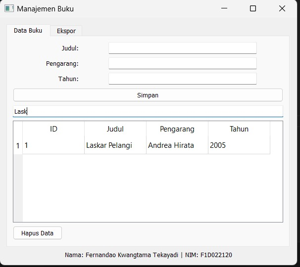
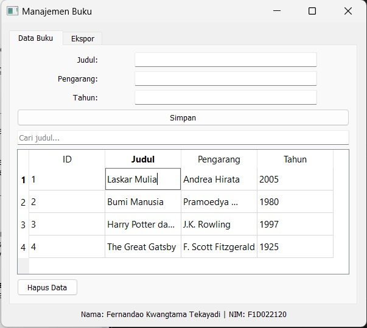
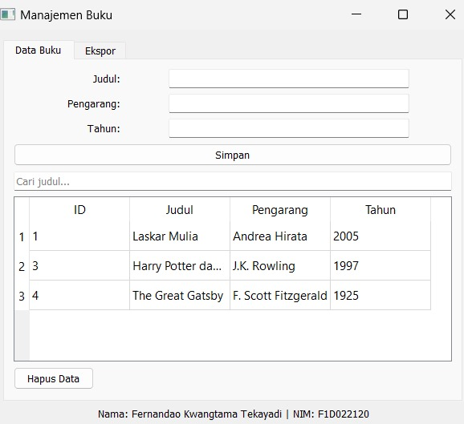
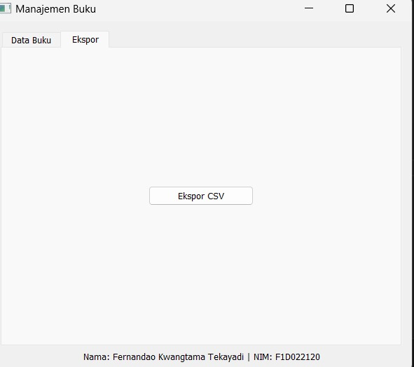
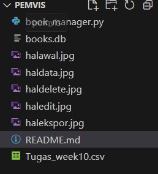

# pv25-week10 - Aplikasi Manajemen Buku

## Fernandao Kwangtama Tekayadi (F1D022120)

## Deskripsi

Fitur utama aplikasi ini meliputi:

- Input data buku (Judul, Pengarang, Tahun)
- Menampilkan data dalam tabel dan bisa diedit
- Pencarian data berdasarkan judul
- Hapus data buku yang dipilih
- Ekspor data buku ke file CSV dengan header lengkap

---

## Screenshot

  
\_Gambar di atas menunjukan tampilan awal dari aplikasi manajemen buku ketika sudah diisi datanya

  
\_Gambar di atas menunjukan tampilan ketika judul di search akan menampilkan judul tersebut

  
\_Gambar di atas menunjukan tampilan ketika data di edit dengan pencet dua kali di yang mau di edit

  
\_Gambar di atas menunjukan tampilan ketika data sudah di delete

  
\_Gambar di atas menunjukan tampilan agar bisa ekspor csv ke folder yang diinginkan

  
\_Gambar di atas menunjukan isi folder di mana ada database bernama books db dan csv ketika sudah di ekspor

---
